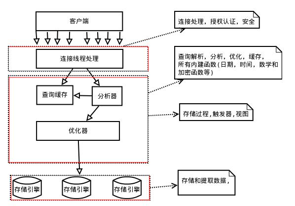
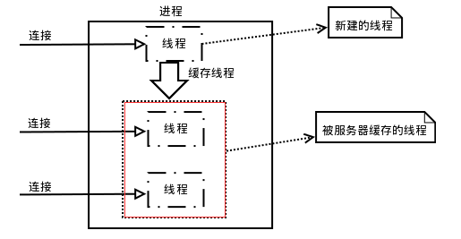
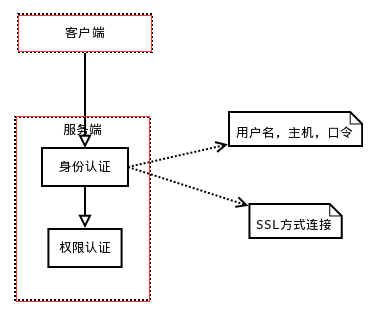
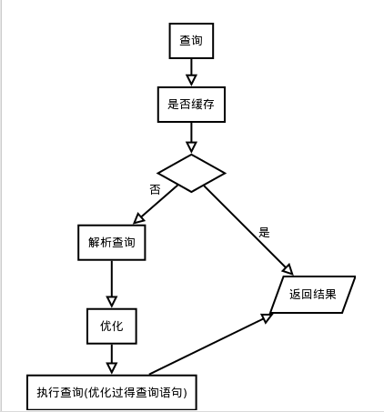

## MySQL架构与历史
+ MySQL的逻辑架构

 
 + MySQL缓存线程

 
 + MySQL验证

 
 + MySQL的查询优化

 
+ MySQL的第二层实现包含了一系列MySQL比较重要的特性:
    + 查询解析，分析，优化，缓存，内置函数
    + 跨存储引擎功能:存储过程，触发器，视图等

+ MySQL的第三层包含了存储引擎:负责MySQL中数据的存储和提取

+ MySQL并发控制
    + 读写锁
    + 锁粒度
        + 表锁
        + 行锁

+ MySQL事务
    + 事务的开启 提交 撤回:START　TRANSACTION ，COMMIT ，ROLLBACK
    + 事务的特性:原子性，一致性，隔离性，持久性
    + 事务的隔离级别:
        + READ UNCOMMITTED 未提交读，即使事务未提交，修改对其他事务也是可见的
        + READ COMMITTED 提交读，只有事务被提交后修改才可以被其他事务看见
        + REPEATABLE READ 可重复读，MySQL默认隔离级别
        + SERIALIZABLE 可串行化，会在处理的每一行数据加上锁，性能弱鸡，非常安全
    + 死锁
        + 当多个事务以不同顺序锁定资源时可能发生死锁
        + 当多个事务同时锁定同一个资源时也会发生死锁
    + MySQL中的事务
        + 自动提交:查询会当作一个提交操作
        + show variable like 'autocommit'; 0 off , 1 on
        + 设定隔离级别 set transaction isolation level + 隔离级别
        + 为每张表选择合适的存储引擎非常重要，如果出现回滚，在非事务型的表就不能执行回滚操作
        + INNODB在执行事务的过程中会执行隐式锁定，当commit 或 rollback后会同时释放所有的锁定。建议在不禁用autocommit时不要显式执行锁定。

+ MySQL的存储引擎
    + 查看表的信息:show table status like + 表名
    + INNODB
        + innoDB被设计用于处理大量的短期事务，大量短期只正常提交，很少会回滚的事务。
        + innoDB表是基于聚簇索引建立的。聚簇索引对主键的查询性能非常高，但是它的二级索引（非主键索引）中必须包含主键列，所以如果主键列很大，那么其他索引列都会很大。因此，在索引比较多的表上，主键应该尽可能小。
    + MyISAM
        + MyISAM 提供了大量的特性，包括全文索引，索引压缩，空间函数等，但MyISAM不支持事务和行锁，而且崩溃后无法安全恢复。对于只读数据，表比较小，可以忍受修复操作则可以继续使用。
        + MyISAM对整张表进行加锁，读取时会对所有读到的表加共享锁，写入时则对表加排他锁
        + 如果在创建并导入数据后不会在进行修改操作，那么这样的表或许适合采用MyISAM压缩表。压缩表可以极大的减少磁盘占用空间，提升查询性能。
    + 其他引擎......

+ 选择合适的引擎
    + 大部分情况下 innoDB都是正确的选择（支持事务，行级锁，高性能聚簇索引）
    + 如果要用到全文索引，优先考虑InnoDB + Sphinx的组合，而不是MyISAM
    + 在不在乎并发性，可拓展，和崩溃等因素，对磁盘占用敏感时，则采用MyISAM
    + 除非万不得已，不要在统一数据库中混用不同的存储引擎。
    + 混用不同的存储引擎需要考虑到的因素：
        + 事务 ：如果需要事务，选择innoDB。否则只要select 和 insert那么选择MyISAM。
        + 备份 ：如果需要热备份，innoDB就是基本的要求
        + 崩溃恢复 ：InnoDB
        + 特有特性 ：根据不同存储引擎来选择
+ 常见应用的存储引擎选择方案    
    + 日志型应用 ：MyISAM和Archive 对这类应用比较合适，因为他们开销低，插入速度非常快。
    + 只读，或者大部分情况下只读的表：选择MyISAM是不错的选择。前提是不介意MyISAM的崩溃修复问题（MyISAM只将数据写入内存，然后等待操作系统定期将数据刷出到磁盘），但是InnoDB或许会是更佳的选择。因为MyISAM一开始可能没有任何问题，但是随着数据量的攀升，压力的增加，则可能迅速恶化。各种锁争用，崩溃后的数据丢失问题都会随之而来。
    + 订单处理 ：InnoDB
    + 论坛，博客等web应用 ：建议采用MongoDB

+ 转换表的引擎
    + alter table table_name engine = InnoDB; 适用任何，但执行时间比较长
    + 先创建一个相同的表，再改引擎，然后做插入操作。
        + create table second like first;
        + alter table second engine = myisam;
        + insert into second select * from first;
        + 如果需要更安全的措施，就在插入环节加上事务

