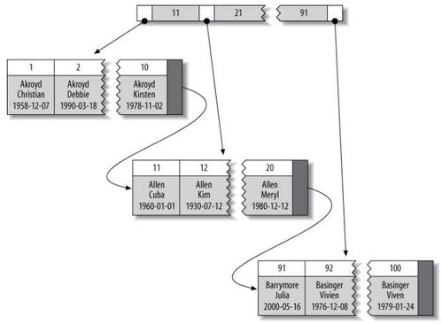

## 创建高性能索引

+ 索引基础
    + 索引的类型
        + B-tree索引
            + MyISAM使用前缀压缩技术，使得索引更小
            + InnoDB按照数据原格式存储
            + B-tree数据结构表明所有的数据都按顺序存储
            + B-tree索引匹配规则:
                + 全值匹配 : where target = 'value'
                + 匹配最左前缀
                + 匹配列前缀 : where target like 'val%'
                + 匹配值范围 : where target between 1 and 10
                + 联合索引的精准匹配第一列和模糊匹配第二列等
                + 只访问索引的查询 : 索引覆盖，select a,b,c from table; a b c 为联合索引
            + B-tree索引的限制:
                + 如果不是按照索引的最左列开始查找，则无法使用索引
                + 对于联合索引，无法跳过前部分的列，对后部分的列进行索引查找
                + 对于联合索引，如果查询中从某个列开始使用了范围查找，那么其右边的列都不能使用索引优化查找
        
        + 哈希索引
            ```
            哈希索引基于哈希表实现，只有精准匹配索引所有列的查询才有效。
            对于每一行数据，存储引擎都会对所有索引列计算出一个哈希码，哈希索引将哈希码存储在索引中，同时在哈希表中保存指向每个数据的指针。
            在MySQL中，只有Memory引擎支持哈希索引。
            ```
            哈希索引查找虽然非常快O(1),但是限制很多:
            + 无法排序
            + 不支持模糊查询
            + 无法对单独的列进行索引查找
            + 对数据量有限制，很多数据时会有大量哈希冲突，导致查询由O(1)向O(n)递进
                ```
                InnoDB有一个特殊的功能叫"自适应哈希索引"。当InnoDB注意到某些索引使用非常频繁时，会在内存中基于B-tree索引再创建一个哈希索引。
                ```
            + 在B-tree中使用哈希来优化查询
                ```
                例如需要存储大量URL，并根据URL进行搜索查找，如果使用B-tree索引，那么存储的内容就会很大，性能就会降低。
                如果url只作为常规列存储，并为url提供一个哈希值的索引列hash_url那么性能将大大提高:
                select * from table where url = "www.mysql.com" and hash_url = CRC32("www.mysql.com");

                首先创建表：
                create table pseudohash (
	            id int unsigned NOT NULL auto_increment,
	            url varchar(255) NOT NULL,
	            url_crc int unsigned NOT NULL DEFAULT 0,
	            primary key(id));

                然后创建插入触发器:
                DELIMITER //
	            DROP  TRIGGER IF EXISTS `pseudohash_crc_ins`;
	            CREATE TRIGGER pseudohash_crc_ins BEFORE INSERT ON pseudohash FOR EACH ROW begin
	            SET NEW.url_crc=crc32(NEW.url);
	            END ;

                创建更新触发器:
                DELIMITER //
	            DROP  TRIGGER IF EXISTS `pseudohash_crc_upd`;
	            CREATE TRIGGER pseudohash_crc_upd BEFORE UPDATE ON pseudohash FOR EACH ROW begin
	            SET NEW.url_crc=crc32(NEW.url);
	            END ;

                插入和更新:
                insert into pseudohash (url) values ('www.baidu.com');
                update pseudohash set url = 'www.mysql.com' where url = 'www.baidu.com';

                其他:
                在查语句中使用定值查找是为了解决哈希冲突
                ```
    
        + 空间数据索引(R-tree)
            + MyISAM支持空间索引，可以用作地理数据存储
        
        + 全文索引
            + 全文索引是一种特殊类型的索引，它查找是文本中的关键词，而不是直接比较索引中的值
            + 在相同列同时创建B-tree索引和全文索引不会发生冲突。全文索引用于match aganst操作，而不是普通的where条件操作
        
        + 其他索引类别
    
+ 索引的优点
    > 索引可以让服务器快速地定位到表的指定位置
    + 索引大大减少了服务器需要扫描的数据量
    + 索引可以帮助服务器避免排序和临时表
    + 索引可以将随机IO变为顺序IO
    > 对于非常小的表，大部分情况下简单的全表扫描更高效

+ 高性能索引策略
    + 独立的列 : 索引列不能是表达式的一部分或者函数的参数
        + select * from table where id + 1 = 5;
        + select * from table where TO_DAYS(current_date) - TO_DAYS(day) < 10;

    + 前缀索引和索引选择性
        ```
        通常可以索引列开始部分字符，这样可以大大节约索引空间，从而提高索引效率，但同时也会降低索引的选择性。
        索引的选择性是指不重复的索引值
        ```
    + 如何设置合适的前缀索引？
        ```
        1.通过不断对比索引选择性来确定前缀索引的最佳范围
        select count(*) as cnt ,city from table GROUP BY city ORDER BY cnt DESC;
        select count(*) as cnt ,LEFT(city,3) as pref from table GROUP BY pref ORDER BY cnt DESC;
        select count(*) as cnt ,LEFT(city,7) as pref from table GROUP BY pref ORDER BY cnt DESC;

        2.直接调取公式计算
        select count(distinct city)/count(*) from table;
        通过上述公式计算出比例值，然后通过不断试探得出最接近这个比例值得前缀索引
        select count(distinct LEFT(city,4))/count(*) from table;
        select count(distinct LEFT(city,5))/count(*) from table;
        select count(distinct LEFT(city,6))/count(*) from table;
        select count(distinct LEFT(city,7))/count(*) from table;

        3.创建前缀索引
        ALTER TABLE database.table ADD KEY (city(7));

        4.MySQL无法使用前缀索引做ORDER BY和GROUP BY操作，也不能做索引覆盖
        ```
    
    + 多列索引
        ```
        常规的多列索引
        crete table t(
            c1 int,
            c2 int,
            c3 int,
            key(c1),
            key(c2),
            key(c3)
        );
        这种索引创建策略是非常错误的
        EXPLAIN + 查询语句可以检测MySQL服务器的优化策略
        ```
        + 多列索引策略
            ```
            用EXPLAIN关键字可以查询到服务器执行查询语句的优化策略
            index_merge 是一种优化结果，但实际上更多地说明了表上的单列索引建的很糟糕
            ```
            + 当出现服务器对多个索引做相交操作时(and)，通常要包含多个相关列的多列索引，而不是多个独立的单列索引
            + 当服务器需要对多个索引做联合操作时，通常会发生index_merge操作
            + 当使用EXPLAIN看到有索引合并时，应好好检查表的索引和查询语句

    + 为联合索引选择合适的索引列顺序
        > 顺序不适当的联合索引，即使在查询中使用了改索引也会因为数据量的增加而变得效率低下
        + 将选择性高的列放在索引最前列

    + 聚簇索引
        > 聚簇索引不是一种索引类型，而是一种数据存储方式

        
        ```
        数据存放在叶子页,节点页只包含了索引列
        InnoDB通过主键聚集数据
        如果没有指定主键，InnoDB会选择一个非空的唯一索引代替，如果再没有这样的列，InnoDB将会隐式定义一个主键。
        ```
        + 聚簇索引的优点
            + 可以把相关数据保存在一起(myISAM的数据和索引则是分开存储，InnoDB聚簇索引既是整个表)
            + 数据访问更快
            + 使用索引覆盖扫描的查询可以直接使用页节点中的主键值
        + 聚簇索引的缺点
            + 聚簇数据最大限度地提高了IO密集型应用的性能，但如果数据全部放在内存，那聚簇索引优势就没了
            + 插入速度严重依赖于插入顺序(随机插入最好使用OPTIMIZE TABLE优化)
            + 更新聚簇索引列的代价很高，因为这会强制InnoDB将每个被更新的列移动到新的位置
            + 聚簇索引可能导致全表扫描变慢
            + 二级索引(非聚簇，非主键索引)的大小会很大，因为二级索引的叶子节点包含了引用行的主键列
            + 二级索引访问需要两次索引查找
        + InnoDB和MyISAM的数据分布对比
            + MyISAM表数据和索引分开存储，主键索引和二级索引存储了键值和行号，构成B树，并相对独立。通过行号取整行数据
            + InnoDB表数据既是聚簇索引，二级索引分开存储，二级索引B树包含了二级索引键值和主键值，通过二级索引查找到主键值，然后回表查询聚簇索引B树取整行数据
        + 在InnoDB表中按主键顺序插入行
            + 方法是为表增加auto_increment属性的主键，这样所有自动生成主键值的插入都会变成顺序插入
            + 随机插入将导致页分裂和磁盘碎片，会导致插入时间边长和索引大小增加
            + 高并发下时auto_increment 可能引发竞争关系

    + 索引覆盖
        > 如果一个索引包含所有需要查询的字段的值，我们就称之为索引覆盖
        + 当使用了索引覆盖时，在EXPLAIN 的 EXTRA列可以看到Using Index的信息

    + 使用索引扫描来做排序
        ```
        MySQL有两种方式可以生成有序结果:通过排序操作order by，按索引顺序扫描
        如果EXPLAIN的type 显示为'index' 那么说明MySQL使用了索引扫描来做排序

        MySQL可以使用一个索引既满足查找又满足排序，设计索引时应当最好满足这两个
        ```

    + 前缀索引

    + 冗余和重复索引
        > 重复索引是指在相同的列上按照相同的顺序创建的相同类型的索引，应当避免，发现也要立刻排除
        + 如果创建了索引(a,b),那么索引(a)就是冗余索引，因为a只是(a,b)的一个前缀索引，而b，和(b,a)则不是。

    + 未使用的索引

    + 索引和锁


