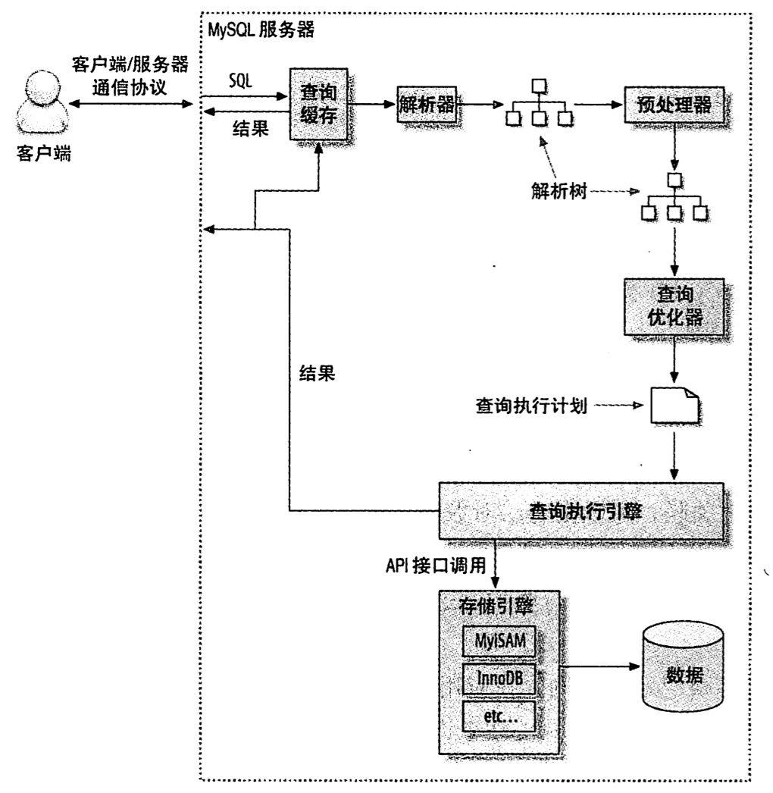

## 查询性能优化
+ 为什么查询速度会慢？
    ```
    如果把查询当作一个任务，那么它由一系列子任务组成，每个子任务都会消耗一定时间。
    如果要优化查询，实际上要优化子任务，要么消除一些子任务，要么减少子任务的执行次数，要么让子任务运行的更快。
    查询的生命周期大致可以按照顺序来看:客户端-服务器-服务器上解析-生成执行计划-执行-返回结果给客户端。
    在完成这些任务时，查询需要在不同的地方花费时间，包括网络，cpu计算，生成统计信息和执行计划，锁等待等操作。尤其是向底层存储引擎检索数据的调用操作
    ```

+ 慢查询基础 : 优化数据访问
    ```
    查询性能低下的最根本原因就是访问的数据太多。大部分性能低的查询都可以通过减少访问数据量的方式优化。对于低效查询，可以从下面两方面检查:
        1.确认查询语句是否在检索大量超过需要的数据
        2.确认MySQL服务器层是否在分析大量超过需要的数据行
    ```
    + 是否向数据库请求了不需要的数据？下面是一些典型的错误案例
        + 查询不需要的记录 : 解决方法是配合Limit只取需要的数据
        + 多表关联时返回全部列
        + 总是取出全部列 : 严禁使用select * 的写法，只取需要的列
        + 在程序中不使用缓存将频繁使用的查询数据缓存起来，重复调用这些查询语句
    
    + MySQL是否在扫描额外的记录
        ```
        对于MySQL，最简单衡量擦汗寻开销的三个指标
            1.响应时间
            2.扫描的行数
            3.返回的行数
        这三个指标都会记录到MySQL的慢日志中，所以检查慢日志记录是找出扫描行数过多的查询的好办法
        ```
        + 响应时间 : 服务时间和排队时间之和
            + 服务时间 : 数据库处理这个查询真正花了多长时间
            + 排队时间 : 各种等待处理查询的时间
        + 扫描的行数和返回的行数
            + 理想情况下扫描的行数和返回的行数应该是相同的。通常扫描行数和返回的行数比例在 1:1到10:1之间
        + 扫描的行数和访问类型
            > 使用explain关键字可以分析出查询语句以何种方式访问数据，扫描了多少行的数据才取得结果等信息。
            + 如果查询没有找到合适的访问类型，那么通常最好是增加一个合适的索引
            + 一般MySQL能使用如下三种方式应用where条件，从好到坏依次为:
                + 在索引中使用where过滤，这是在存储引擎层完成
                + 使用索引覆盖扫描(Extra中出现Using Index)，这是在MySQL服务器层完成，无需回表
                + 从数据表中返回数据，然后再过滤(Extra中出现Using Where)，这是在MySQL服务器层完成
            + 通过使用explain和count(*)可以算出扫描行和返回行的比例
            + 如果发现扫描行和返回行比例非常大，可以尝试下面的技巧去优化:
                + 使用索引覆盖
                + 该表库表结构，例如汇总表等
                + 重写查询语句

+ 重构查询的方式
    + 一个复杂查询还是多个简单查询？
    + 切分查询
        ```
        有时候我们需要对一个大查询切分成小查询，每个查询功能一样，只完成一小部分。这样可以大幅缓解MySQL服务器压力，让应用受到MySQL服务器的影响最小化
        例如 : 删除旧数据就是一个很好的例子。
            DELETE from table WHERE created < DATE_SUB(NOW(),INTERVAL 3 MONTH);
            
            rows_affected = 0
            do{
                rows_affected = do_query(
                    "DELETE from table WHERE created < DATE_SUB(NOW(),INTERVAL 3 MONTH) LIMIT 10000")
            }while rows_affected > 0
        ```
    + 分解关联查询
        ```
        很多高性能应用会对关联查询进行分解:
            SELECT * FROM table
                JOIN table_1 ON table_1.id = table.id
                JOIN table_2 ON table_2.num = table.num
                WHERE table.title = 'mysql';
        分解为:
            SELECT * FROM table WHERE table.title = 'mysql';
            SELECT * FROM table_1 WHERE table_1.id = 123;
            SELECT * FROM table_2 WHERE table_2.num in (1,2,3,4,5);
        ```
        + 分解关联查询的优势有:
            + 让缓存的效率更高
            + 将查询分解后，执行单个查询可以减少锁的竞争
            + 在应用层做关联，可以更容易对数据库拆分，更容易做到高性能和可拓展
            + 查询本身的效率可能提升
            + 减少冗余记录的查询

+ 查询执行的基础

    

    + MySQL客户端/服务端通信协议
        ```
        MySQL客户端和服务器之间的通信协议是半双工的。在任何一个时刻，要么是由服务器向客户端发送数据，要么是客户端发送数据给服务器。

        MySQL对于查询结果有两种处理方式:
            1.一次性缓存到本地，可以减轻服务器压力，但会增加本地压力
            2.不缓存，这样服务器的资源就会一直被这个链接占用，直到所有结果都处理完
        ```

    + 查询状态
        > show full processlist (command 列表示当前状态)
        + Sleep : 链接等待客户端发送新的请求
        + Query : 线程正在执行查询或者正在将结果发送给客户端
        + Locked : 在MySQL服务器层，该链接正在等待表锁
        + Analyzing and statistics : 链接正在收集存储引擎的统计信息，并生成查询的执行计划
        + Copying to tmp table [on disk] : 链接正在执行查询，并将其结果集都复制到一个临时表中，这种标志下一般在做group by操作，或者文件排序，Union操作。如果后面有[on disk],说明MySQL正在将一个内存临时表放到磁盘上
        + Sorting result : 链接正在对结果排序
        + Sending data : 向客户端返回数据，生成结果集，或者在多个状态之间传送数据

    + 查询缓存
        ```
        在解析一个查询语句之前，如果查询缓存是打开的，那么MySQL会优先检查这个查询是否命中查询缓存中的数据
        ```
    
    + 查询优化处理
        ```
        查询的生命周期的下一步是将一个SQL转换成一个执行计划，MySQL再依照这个执行计划和存储引擎进行交互。
        这里面包括多个子阶段: 解析SQL，预处理，优化SQL执行计划
        这个过程中任何错误(语法错误)都可能终止查询
        ```
        + 语法解析器和预处理
        + 查询优化器
            ```
            MySQL使用基于成本的优化器，它将尝试预测一个查询使用某种执行计划时的成本，并选择其中成本最小的一个。

            show status like 'Last_query_cost';
            可以查询到某个语句花费的成本，需要做多少个数据页的随机查找才能完成这个查询

            有很多种原因会导致MySQL优化器选择错误的执行计划 :
                1.统计信息不准确
                2.执行计划中的成本估算不等于实际执行的成本
                3.MySQL优化器是基于成本，但成本最低并不意味速度最快
                4.MySQL优化器不会考虑其他并行的查询
                5.MySQL不会考虑不受其控制的操作成本，比如用户自定义函数等

            MySQL优化策略可以分为 : 静态优化 和 动态优化
                静态优化 : 直接对解析树进行分析，并完成优化
                动态优化 : 需要考虑到方方面面，而且每次执行时都需要重新评估
            ```
            + MySQL能处理的优化类型
                + 重新定义关联表的顺序
                    ```
                    数据表的关联并不总是按照在查询语句中指定的顺序进行。决定关联的顺序是优化器很重要的一部分功能
                    ```
                + 将外连接转化成内连接
                    ```
                    并不是所有的OUTER JOIN语句都必须以外连接的方式进行。例如WHERE条件,库表结构等都可能让外连接等价于一个内连接。MySQL能识别并重写查询，让其调整关联顺序
                    ```
                + 使用等价变换规则
                    ```
                    MySQL可以使用一些等价变换来规范查询，比如:a>5 and a=5 即可写为 a>=5 之类
                    ```
                + 优化count(),min(),max()
                    ```
                    索引和列 是否为空通常可以帮助MySQL优化这些表达式。
                    min()只要取索引第一列
                    max()只要取索引最后列
                    ```
                + 预估并转化为常数表达式
                    ```
                    比如上面的min() max()
                    explain中 select tables optimized away
                    ```
                + 覆盖索引扫描
                + 子查询优化
                + 提前终止查询
                + 等值传播
        
        + 数据和索引的统计信息
            ```
            统计信息由存储引擎实现。
            因为服务器层没有统计信息，所以MySQL查询优化器在生成查询的执行计划时，需要向存储引擎获取相应的统计信息。这些统计信息包括:
                1.每个表或索引有多少个页面
                2.每个表的每个索引的基数是多少，数据行和索引长度，索引的分布信息等。
            ```

        + MySQL如何执行关联查询？
            ```
            对于UNION查询:
                1.MySQL先将一系列的单个查询结果放到一个临时表中，然后再读出临时表的数据完成UNION查询
                2.MySQL先在一个表中循环取出单条数据，然后再嵌套循环到下个表中寻找匹配的行，依次下去，直到找到所有表中的匹配行为止。
                3.然后根据各个表匹配的行，返回查询中需要的各个列
            总之是一种深度优先搜索策略
            ```

        + 关联查询优化器
            > 负责关联查询表关联顺序,优化器会决定关联表在整个查询中的执行顺序
        
        + 排序优化
            > 排序是一个成本很高的操作，所以从性能方面考虑，应该尽量避免大量数据的排序
            ```
            当不能使用索引生成排序结果时，MySQL需要自己排序。如果数据量小则在内存中进行。如果数据量大则要用到磁盘。
            ```

    + 查询执行引擎

    + 返回结果给客户端

+ MySQL查询优化器的局限性
    + 关联子查询
        ```
        对于嵌套查询:
            select * from table_1 where film_id in 
                (select film_id from table_2 where id = 1);

        我们可能会觉得MySQL按如下顺序执行 :
            1. result = select film_id from table_2 where id = 1;
            2. select * from table_1 where film_id in result;
        
        但实际上MySQL不是这样做的，MySQL会将相关的外层表压倒子查询中，认为这样可以更高效率查找到数据行。即 :
            select * from table_1 
                where exists(
                    select * from table_2 where id = 1 
                    and table_1.film_id = table_2.film_id);

        这时复杂度由O(n) 向 O(n2)递进
        ```

        + 如何用好关联子查询？
            ```
            并不是所有的关联子查询性能都很差。在确定是否用关联子查询前使用explain检测一下
            在使用explain检测出MySQL的执行计划后再选择合适的写法
            ```

    + UNION的限制

    + 索引合并优化

    + 等值传递

    + 并行执行

    + 哈希关联

    + 松散索引扫描

    + 最大值和最小值优化
    
    + 在同一个表上查询和更新

+ 查询优化器的提示


+ 优化特定类型的查询
    + 优化count()查询   

    + 优化关联查询
        + 确保ON或者USING子句中的列上有索引
        + 确保任何的GROUP BY和ORDER BY中的表达式只涉及到一个表中的列
    + 优化子查询
        > 使用关联查询代替
    + 优化GROUP BY 和DISTINCT

    + 优化LIMIT 分页